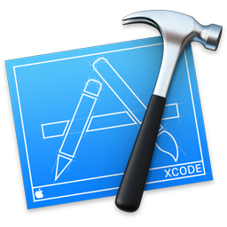
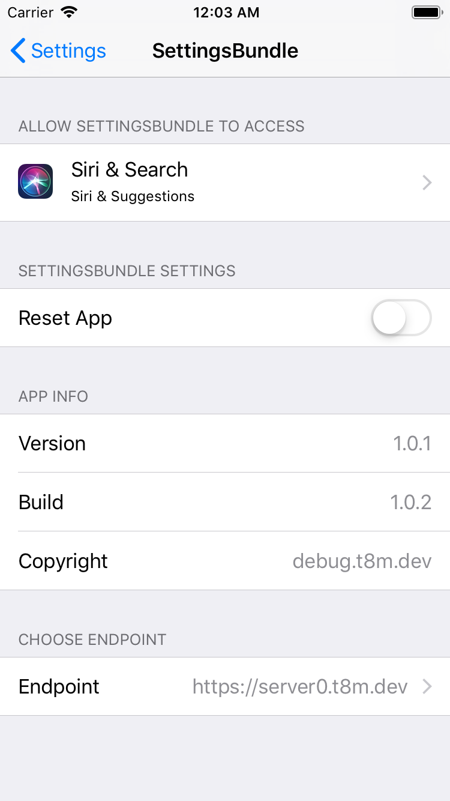
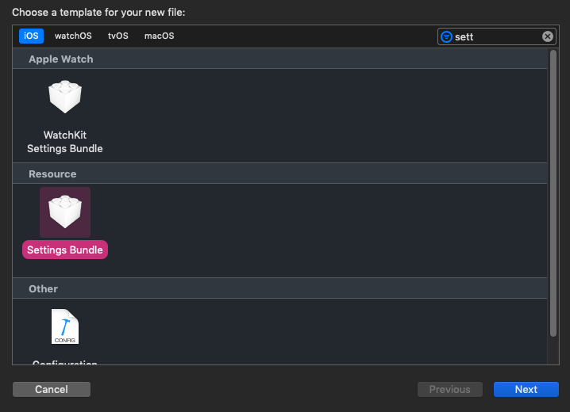
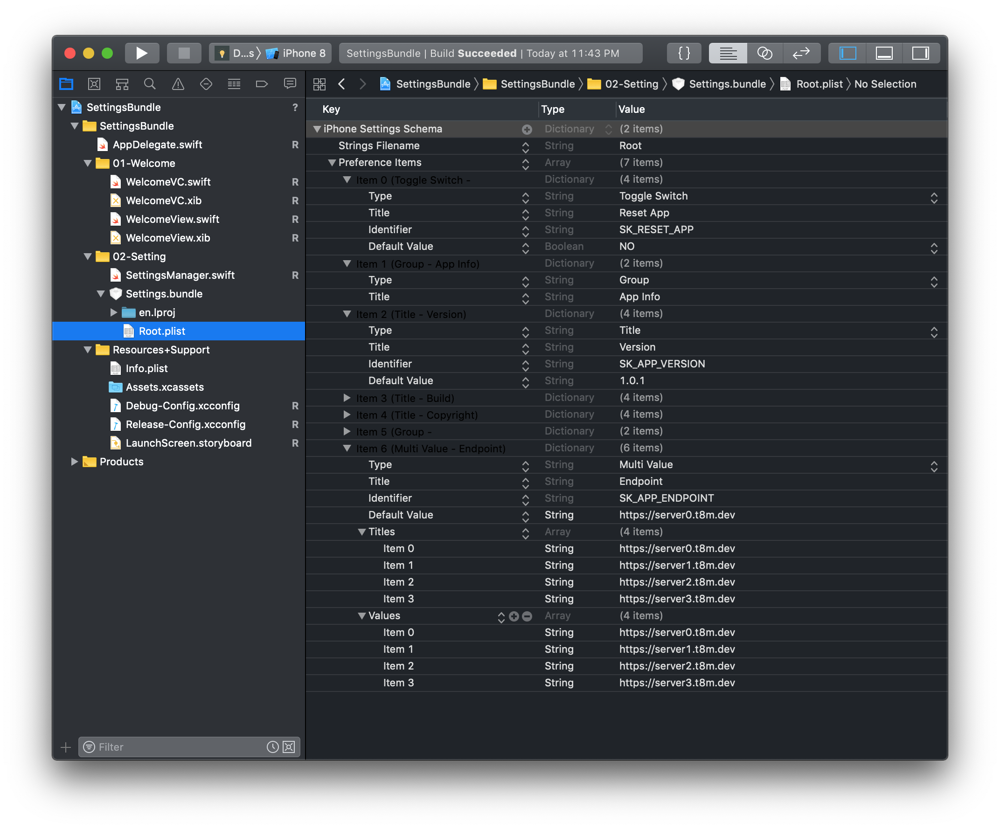
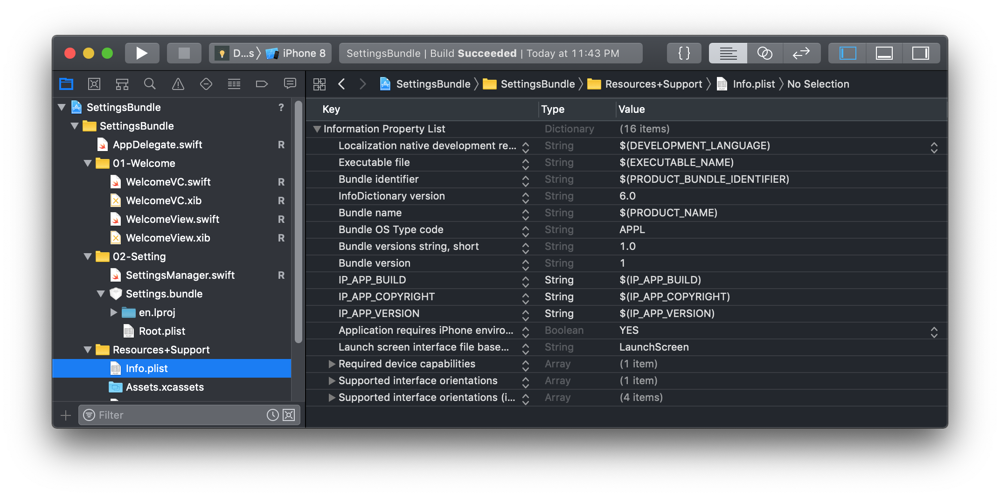
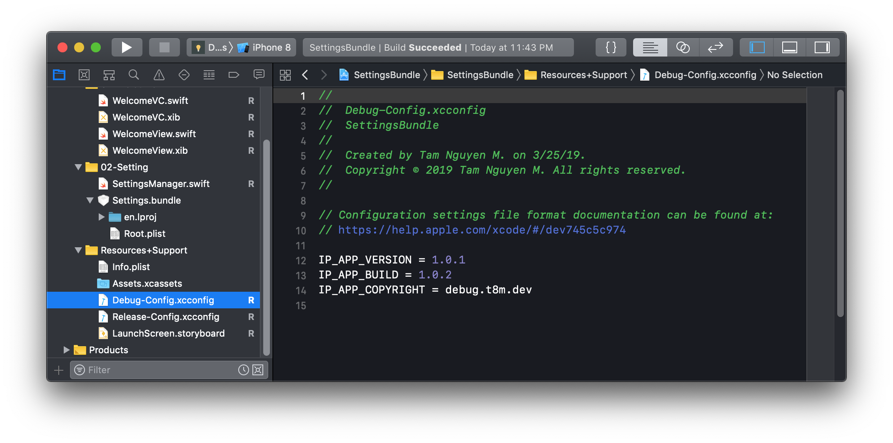

##  How to use Settings.bundle in iOS Project

_Written by: **Nguyen Minh Tam**_

> **Related topics:**
>
> - Working with multiple Targets. [See detail][Targets].
> - Manage Targets - Schemes in an iOS Project. [See detail][ProjectTargetScheme].
> - How to use Settings.bundle in iOS Project. [See detail][Settings].

### Goal

In this session, I will talk about the way we work with `Settings.bundle` so as to:

- [x] Change state of my application in Settings
- [x] Bind data to values in Settings

In addition, in the demo of this session, I have involved using file `*.xcconfig` to store data of two schemes (Debug and Release) for one target. I have used that data in order to bind to values in Setting. And the final result will be like this:

<center>
	
</center>

### Getting started

**Use case**

Normally all applications have login and logout features. So, to reset the app data we have to click on logout button and clear all database/user defaults data.

But what if we want to reset the app data while that application doesn't have login/logout functions? Also, we don’t want to add any button from inside the app to do that.

It leads to this problem. In the very first moment opening app, the welcome pop up will be presented. The presentation is defined by the boolean property in user defaults data with key `K_DID_OPEN_APP`. So, we have to reinstall the app every single time we check this feature. That is the reason why we need a reset button in Setting so as to test this feature without uninstalling the app.

Besides, we also need add the version and build number in the settings.

<center>
	
</center>

As it mentioned in [official doc][Preference], in iOS, the Foundation framework provides the low-level mechanism for storing the preference data. Apps then have two options for presenting preferences:

- Display preferences inside the app.
- Use a Settings bundle to manage preferences from the Settings app.

Which option you choose depends on how you expect users to interact with preferences. The Settings bundle is generally the preferred mechanism for displaying preferences. However, games and other apps that contain configuration options or other frequently accessed preferences might want to present them inside the app instead. Regardless of how you present them, you use the NSUserDefaults class to access preference values from your code.

### The Settings App Interface

The Settings app has at least one page, referred to as the main page:

- The main page: lists the system and third-party apps whose preferences can be customized. 
- If the number of preferences gets too large, we can create child pages that link off the main pag  / other child pages.
- There is no limit of child pages, but we should keep simple as much as possible.

Each page consists one / more configure. These are the types of controls supported by the Settings app:

- Text field
- Title
- Toggle switch
- Slider
- Multivalue
- Group
- Child pane

See detail in official doc [here][Preference] and [here][Schema reference].

### The Settings Bundle

A Settings bundle has the name `Settings.bundle` and resides in the top-level directory of your app’s bundle. This bundle contains one or more Settings page files that describe the individual pages of preferences. It may also include other support files needed to display your preferences, such as images or localized strings.

You can find out more information about contents of the Settings.bundle directory and loading language for Settings in [official doc][Preference].

Right now, I will show you how we reach the goal mentioned in the very first part of this session. So let's get start! 🎌

### Creating and Modifying the Settings Bundle

To add a Settings bundle to your Xcode project:

- Choose **File > New > New File**.
- Under iOS, choose **Resource**, and then select the **Settings Bundle** template.
- Name the file `Settings.bundle`.

<center>
	
</center>

In addition to adding a new Settings bundle to your project, Xcode automatically adds that bundle to the Copy Bundle Resources in Build Phase of your app Target. Thus, all you have to do is modify the property list files of your Settings bundle and add any needed resources.

<center>
	
</center>

Click on the `Root.plist` file. The preference items is an array of dictionaries of controls .

In this demo, I need:

- 1 Toggle switch: Reset App for deleting all app states have been saved, like: choosen endpoint, app did open,...
- 1 Group: App info
- 3 Tilles: For showing Version, Build, Copyright
- 1 Group: Choose endpoint
- 1 Multi value: Endpoint, for changing this endpoint

<center>
	
</center>

**Note:** 

- The **Identifier** is the **user defaults key** that we use inside code to manipulate property. 
- Don’t forget to add the **Default values** for **Title**. It will not appear in the settings otherwise.
- We will have a hard time when working with file `*.plist` because of the order of controls, **Right click on file `*.plist` > Open as source code > Edit XML**.

Next, I will talk about how to modify Settings' value. First of all, open project at `./SettingsBundle/SettingsBundle.xcodeproj`. Open class `SettingsManager` and you will see this:

```swift
enum InfoKey: String {
    // IP = Info.plist, defined the same as in Info.plist
    case kBuild = "IP_APP_BUILD"
    case kVersion = "IP_APP_VERSION"
    case kCopyright = "IP_APP_COPYRIGHT"

    // K = Other keys, save app state
    case kDidOpenApp = "K_DID_OPEN_APP"
    case kEndpoint = "K_APP_ENDPOINT"
}

final class SettingsManager {
    enum SettingKey: String {
        // SK = SettingKey
        // Keys which have constant value
        case kBuild = "SK_APP_BUILD"
        case kVersion = "SK_APP_VERSION"
        case kCopyright = "SK_APP_COPYRIGHT"

        // Keys which have changing value
        case kReset = "SK_RESET_APP"
        case kEndpoint = "SK_APP_ENDPOINT"
    }
    ...
} 
```

InfoKey values are defined the same as in `Info.plist`, these values are get from `Debug-Config.xcconfig` / `Release-Config.xcconfig` files, depends on which scheme we are choosing. I showed detail steps in the previous section about [Manage Targets - Schemes in an iOS Project.][ProjectTargetScheme]. Now, take a look at what we got in `Info.plist` and `Debug-Config.xcconfig` files.
    
<center>
	
	
</center>

The first time running app, we need to config all settings value follow these requirements:

```
final class SettingsManager {
	 ...    
    func configAppSetting() {
        // Config when reset is true, reset all app
        if ud.bool(forKey: SettingKey.kReset.rawValue) {
            resetUserDefaults()
        }

        // Config titles: build number, version number, copyright info
        // Bind from Info.plist to Settings
        change(getValueWith: .kBuild,
               setForSettingValueWith: .kBuild)
        change(getValueWith: .kVersion,
               setForSettingValueWith: .kVersion)
        change(getValueWith: .kCopyright,
               setForSettingValueWith: .kCopyright)

        // Bind from User defaults to Setting
        if let endpoint = getSettingStringValue(forInfoKey: .kEndpoint) {
            change(endpoint, forSettingValueWith: .kEndpoint)
        } else {
            let defaultValue = "https://server0.t8m.dev"
            change(defaultValue, forSettingValueWith: .kEndpoint)
            change(defaultValue, forInfoValueWith: .kEndpoint)
        }

        // Config observer
        configObserver()
    }
    ...
}
```

- If the toggle switch reset is on (key: `SettingKey.kReset`), then clean all saved data, like: endpoint (key: `SettingKey. kEndpoint`) and app states (key: `InfoKey. kDidOpenApp`).
- If not:
	-  Get values of Version, Build, Copyright from `Info.plist`, and set for Settings.
	-  For values which can be changed by users, in this case is endpoint (or theme / ...), we will check if it exists in User defaults values, set it for Settings, if not then set default value for both Setting and User defaults.
	-  The last but not least, we config observer for `SettingManager`, everytime User defaults values changed, do these things:
		- If the toggle switch reset is on, clean all data and restart app (by set new root view controller).
		- If endpoint in Settings was changed, set new endpoint value to User defaults.

This is how we get values of Version, Build, Copyright from `Info.plist`, and set for Settings:

```
final class SettingsManager {
	 ...
    private func change(getValueWith ipKey: InfoKey, setForSettingValueWith sKey: SettingKey) {
        guard let ipValue = getInfoPlistStringValue(forInfoKey: ipKey) else { return }
        change(ipValue, forSettingValueWith: sKey)
    }
    
    private func getInfoPlistStringValue(forInfoKey key: InfoKey) -> String? {
        guard let dic = Bundle.main.infoDictionary,
            let value = dic[key.rawValue] as? String else { return nil }
        return value
    }
    
    func change(_ value: Any?, forSettingValueWith key: SettingKey) {
        if let value = value {
            ud.set(value, forKey: key.rawValue)
        } else {
            ud.removeObject(forKey: key.rawValue)
        }
    }
    ...
}
```

This is how we config observer for `SettingManager`:
	
```
final class SettingsManager {
	 ...
    private func configObserver() {
        NotificationCenter.default.addObserver(self,
                                               selector: #selector(udValuesDidChange),
                                               name: UserDefaults.didChangeNotification,
                                               object: nil)
    }

    /// Handle values in user defaults changing
    @objc private func udValuesDidChange() {
        // If kReset = true, then reset and restart app
        if ud.bool(forKey: SettingKey.kReset.rawValue) {
            resetUserDefaults()
            AppDelegate.shared.restart()
            return
        }

        if let newEndpoint = getSettingStringValue(forSettingKey: SettingsManager.SettingKey.kEndpoint),
            let oldEndpoint = getSettingStringValue(forInfoKey: InfoKey.kEndpoint),
            newEndpoint != oldEndpoint {
            change(newEndpoint, forInfoValueWith: .kEndpoint)
        }
    }
    ...
}
```

Okay, that's what we handle in `SettingManager`. Now we move to making the view controller listen to the changes of User default values. Look at class `WelcomeVC`. We config observer to `UserDefaults.didChangeNotification` event. Everytime values change, we set content of `endpointLabel` again. Moreover, we config `welcomeView` and `endpointLabel` before showing this screen.

```
final class WelcomeVC: UIViewController {
    ...
    override func viewDidLoad() {
        super.viewDidLoad()
        configObserver()
        ...
    }

    override func viewWillAppear(_ animated: Bool) {
        super.viewWillAppear(animated)
        configWelcomePopUp()
        configEndpointLabel()
    }

    private func configObserver() {
        NotificationCenter.default.addObserver(self,
                                               selector: #selector(udValuesDidChange),
                                               name: UserDefaults.didChangeNotification,
                                               object: nil)
    }

    @objc private func udValuesDidChange(notification: Notification) {
        configEndpointLabel()
    }
    ...
}
```

Let's run the app now and see what happen when changing endpoint / turn reset toggle on in Settings. ✌️

<center>
	
</center>

> **Note:**
> 
> Because the `selector` of `addObserver` for notification `UserDefaults.didChangeNotification` will be called everytime user defaults values change. So we should pretty carefully do change the other user defaults values inside that block! For example the `func udValuesDidChange()` of class `SettingManager`.

So, that's it. Now we know basic things about `Setting.bundle`. Please support me writting more and more documents by raising a ⭐️! Thank you so much ~

**Related topics:**

- Manage Targets - Schemes in an iOS Project. [See detail][ProjectTargetScheme].
- How to use Settings.bundle in iOS Project. [See detail][Settings].

**Reference:**

- [Implementing an iOS Settings Bundle][Preference]
- [Settings Application Schema Reference][Schema reference] 

---

[ProjectTargetScheme]: https://github.com/nmint8m/projecttargetscheme
[Settings]: https://github.com/nmint8m/settingsbundle

[Preference]: https://developer.apple.com/library/archive/documentation/Cocoa/Conceptual/UserDefaults/Preferences/Preferences.html
[Schema reference]: https://developer.apple.com/library/archive/documentation/PreferenceSettings/Conceptual/SettingsApplicationSchemaReference/Introduction/Introduction.html